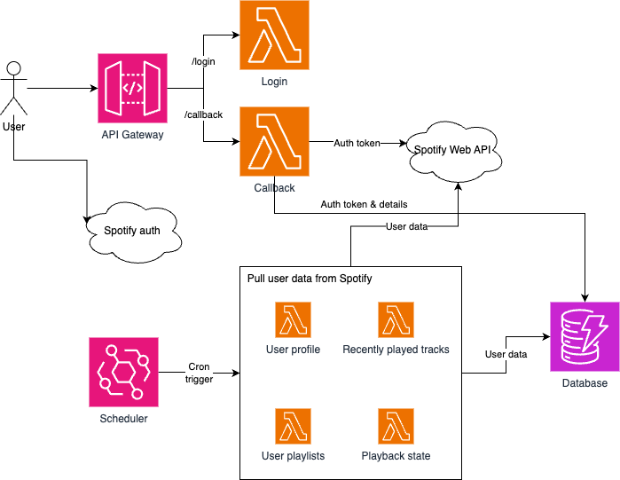

# redesigned-computing-machine

⚠️ Work in progress ⚠️

This project's purpose is to build something to archive and version a Spotify user's data such as playlists (created by, followed, an such) and listening habits (artists, albums, genres, etc.), and then later on to do some sort of analytics based on the data.

## Architecture

(Draft)

The main driving goals in architectural decisions are cost-efficiency and getting to run it on someone else's computer (cloud), while going about the planning and implementation as properly as I can and hopefully according to best practices. Of course this is also a learning exercise.

Thus the stack right now is a bunch of AWS Lambda functions, DynamoDB, API Gateway and EventBridge:

## Other documentation

(Draft)

Other documentation includes:

-   Sequence diagram for user authentication: [./docs/user authentication.mmd](./docs/user%20authentication.mmd)
